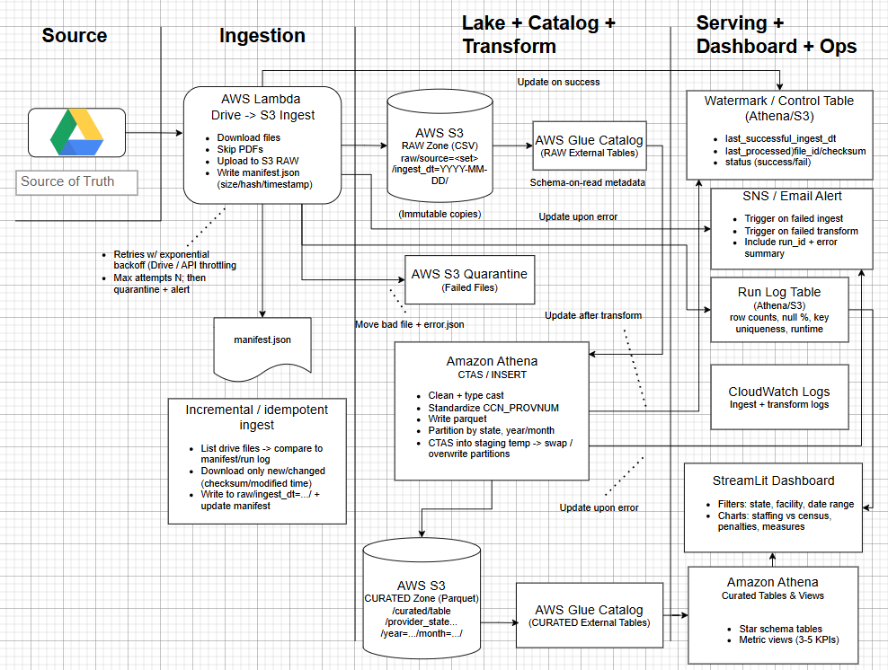
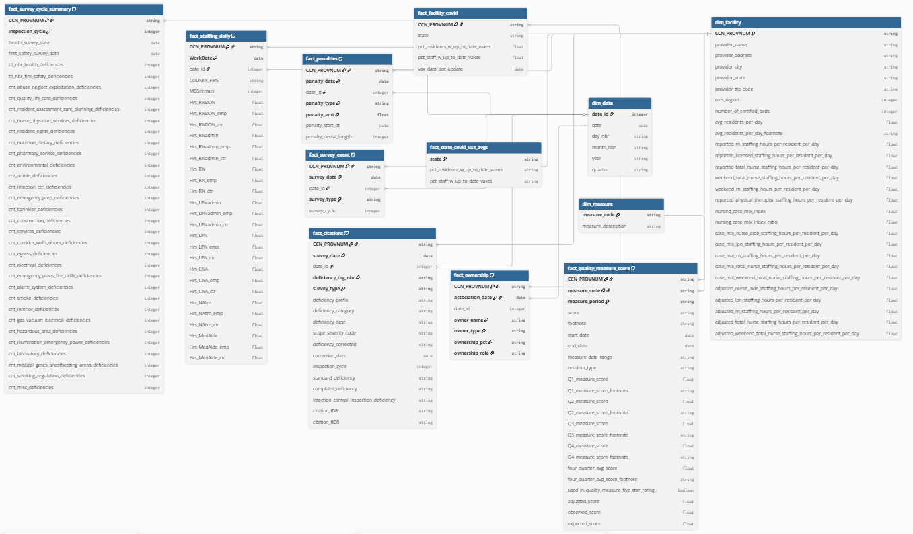
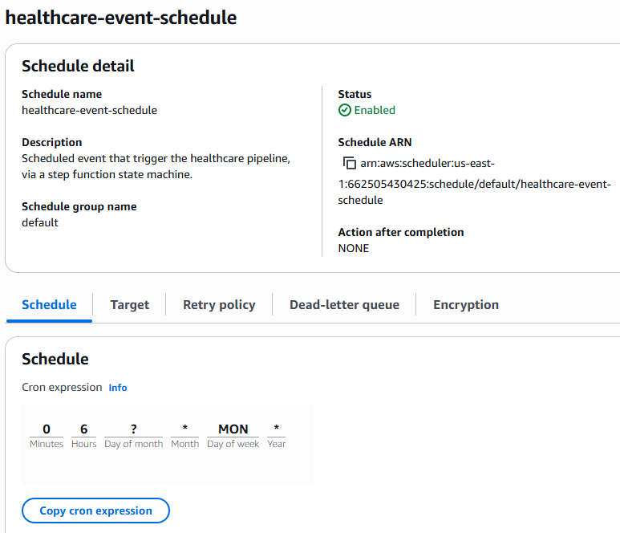

# Healthcare Data Pipeline

## Overview

This project implements an end-to-end healthcare data pipeline on AWS. It ingests raw source files from Google Drive into a partitioned S3 data lake, tracks file-level state through archived and latest manifests, and then runs an Athena-based transformation layer to build curated datasets for analytics and dashboarding. The pipeline is designed to run both locally and in ECS/Fargate using the same Python codebase. 

The pipeline is organized into two main runtime stages:

1. **Ingest stage** (`main_program.py`)  
   Downloads source files, detects changes using SHA-256 checksums, uploads changed files into S3 raw storage, and writes manifest/control artifacts.

2. **Transform stage** (`run_transform.py`)  
   Reads the latest manifest state, determines dataset-specific latest partitions, auto-registers partitions in Athena/Glue, executes ordered SQL transformations, and runs validation checks.

The final solution is containerized, deployed to Amazon ECR, executed as ECS/Fargate tasks, orchestrated with AWS Step Functions, and scheduled with EventBridge Scheduler.

---

## Design Artifacts

### Requirements

https://docs.google.com/document/d/157bbXEilQNwaxbkX9mx-6FXcIv0VgO-9T9uacWAhEh4/edit?tab=t.0#heading=h.y5u6lrxvyr99

### Architecture Design Document

https://app.diagrams.net/?src=about#G11iCahIcH_l5pAPWaTNyd7V3M9DlMwPon#%7B%22pageId%22%3A%22rtwNVA8DXy5ze71Piad0%22%7D



### Database design

https://dbdiagram.io/d/Healthcare-Project-69a1316ba3f0aa31e1445bac



---

## Architecture

### High-level flow

Google Drive source files  
→ ECS/Fargate ingest task  
→ S3 raw zone + control manifests + JSONL inventory  
→ ECS/Fargate transform task  
→ Athena / Glue transformation pipeline  
→ curated healthcare datasets / views  
→ Streamlit analytics dashboard. 

### Core architectural principles

- **Incremental ingestion**  
  Files are hashed with SHA-256 and compared to prior manifest state so unchanged files can be skipped. 

- **Partitioned raw storage**  
  Raw files are stored under dataset-specific prefixes with `ingest_dt=YYYY-MM-DD` partitions in S3. 

- **Manifest-driven processing**  
  The transform layer uses manifest artifacts and a JSONL inventory file instead of relying on hardcoded dates. 

- **Automatic partition registration**  
  The transform runner inspects manifest S3 keys and Glue table metadata to generate partition DDL automatically. 

- **Validation as part of the pipeline**  
  Data checks are executed as a formal final phase, not as an afterthought. 

---

## AWS Services Used

### Amazon S3
S3 serves as both the data lake and the control-store layer. The ingest stage writes:
- raw source data under the raw prefix
- manifest artifacts under the control prefix
- quarantine outputs for files that fail ingest processing. 

#### S3 folder structure

healthcare-data-lake-gj:

	• athena_query_results/
	• control/
	• curated/
	• quarantine/
	• raw/
  • run_log/

### Amazon ECS / AWS Fargate
Both runtime stages are containerized and executed as ECS tasks on Fargate. The code is written to use IAM-role-based credentials automatically in Fargate, while still supporting local AWS profiles during development.

### Amazon ECR
Container images for the ingest and transform modules are stored in separate ECR repositories and pulled by ECS/Fargate at runtime.

### Amazon Athena
Athena is used to execute SQL for:
- table creation
- curated transformations
- partition registration
- validation queries. 

### AWS Glue Data Catalog
Glue is used as the metadata layer for table discovery and partition inspection. The transform runner queries Glue to determine which tables are partitioned and what their underlying S3 locations are. 

### AWS Step Functions
Step Functions orchestrates the full pipeline by running the ingest task first and the transform task second.

### Amazon EventBridge Scheduler
EventBridge Scheduler triggers the Step Functions state machine on a recurring schedule.

### Streamlit Community Cloud
The final analytics dashboard is deployed separately on Streamlit Cloud and queries the curated healthcare analytics layer.

Link to streamlit dashboard repo: https://github.com/guymandev/dea-healthcare-streamlit

---

## Data Flow

### 1. Source acquisition
The ingest stage downloads:
- a public Google Drive folder containing source files
- a standalone PBJ staffing file from Google Drive. 

### 2. File discovery and hashing
The ingest module recursively scans downloaded `.csv` and `.json` files, computes SHA-256 checksums, and compares each file against prior manifest state keyed by filename. 

### 3. Incremental raw load
A file is uploaded to S3 if:
- it is new
- its checksum changed
- or the prior expected S3 object is missing and must be healed. 

Files are written to S3 under paths like:

```text
raw/<dataset_key>/ingest_dt=<YYYY-MM-DD>/<filename>
```

This preserves history and supports downstream partition-aware querying.

### 4. Manifest generation
The ingest stage writes:
- a per-run archived manifest JSON at ```control/manifests/ingest_dt=<date>/manifest.json```
- a rolling latest-state manifest JSON at ```control/manifests/latest/manifest.json```
- a separate, derived latest-files inventory (JSONL view) at ```control/manifests/latest_files/files.jsonl``` for Athena-friendly querying.

### 5. Dataset-aware transformation
The transform stage reads the latest manifest-derived inventory and builds a ```dataset_ingest_map```, allowing SQL files to bind to the latest partition for each dataset individually.

### 6. Partition registration
The transform stage derives partition locations from manifest S3 keys, matches them to Glue table base locations, and generates ```ALTER TABLE ... ADD IF NOT EXISTS PARTITION``` statements automatically.

### 7. Curated SQL pipeline
SQL files are executed in ordered directories:
- ```00_bootstrap```
- ```10_fixed```
- ```20_curated```
- ```90_checks```

### 8. Validation checks
The final phase runs SQL validation checks whose expectations are inferred from the file suffixes such as:
- ```_zero,sql```
- ```_gt_zero.sql```
- ```_g3_one.sql```
A failed check causes the pipeline to fail.

### Key Design Decisions

#### Manifest-driven state management
Instead of trying to infer the latest files directly from S3, the pipeline writes explicit manifest artifacts. This creates a durable, auditable representation of pipeline state and gives downstream steps a stable control input.

#### Partitioned S3 layout
Using dataset-based prefixes plus ```ingest_dt``` partitions allows the raw zone to retain history while still enabling efficient downstream partition selection.

#### Archive manifest + latest-state manifest
The project keeps both:
- a per-run archived manifest
- a rolling latest-state manifest, along with a separate JSONL version of this for Athena.

This supports both historical traceability and simplified downstream "latest file" logic.

#### JSONL inventory for Athena
The ```files.jsonl``` output flattens manifest metadata into a query-friendly structure, which the transform stage then uses to drive dataset-specific partition logic.

#### Dataset-specific ingest-date substitution
The transform runner supports placeholders like ```{{INGEST_DT:dataset_key}}```, which allows each SQL object to bind to the latest available partition for that particular dataset. This avoids assuming that all source datasets arrive on the same day.

#### Safe handling of CTAS output locations
The transform runner supports ```-- S3_PREFIX:``` comments for CTAS outputs, which enables a preflight step to clean target prefix buckets in S3 before reuse. At the same time, it explicitly blocks that mechanism for ```CREATE EXTERNAL TABLE``` SQL files so source data locations are never accidentally deleted.

#### Quarantine on ingest failure
If a file fails ingest processing, the code attempts a best-effort upload to a quarantine prefix for later debugging.

#### Detailed operational logging
Both stages print detailed logs covering:
- region/profile resolution
- checksum comparisons
- prior-manifest comparisons
- partition matches
- SQL statements
- check expectations
- final run summaries

This is especially useful when debugging through ECS/Fargate and CloudWatch logs.

### Ingest Stage Details

#### Responsibilities
- download source files from Google Drive
- detect changed files using checksums
- upload changed files into S3 raw partitions
- maintain manifests and latest inventory files
- quarantine failures when possible

#### Notable implementation details
- uses retry-hardended S3 client configuration
- writes JSON manifests with ```Content-MD5``` integrity checking so S3 can validate the uploaded payload in transit
- supports atomic-ish temp-key copy semantics for JSON writes
- stores run metadata including ```run_ts_utc```
- preserves file-level metadata such as checksum, size, ```data_ingest_dt```, and last-seen run details

#### Example output artifacts
- ```control/manifests/ingest_dt=<YYYY-MM-DD>/manifest.json```
- ```control/manifests/latest/manifest.json```
- ```control/manifests/latest_files/files.jsonl```

### Transform Stage Details

#### Responsibilities
- connect to Athena and Glue
- query latest manifest inventory
- resolve dataset-specific ingest dates
- execute ordered SQL files
- run final validation checks

#### Notable implementation details
- validates that the project runs in the expected AWS region
- supports local named-profile execution or IAM-role-based execution in Fargate
- parses ```-- S3_PREFIX:``` metadata from SQL files
- preflights CTAS output prefixes
- fetches Athena result rows for validation logic
- prints a final run summary with partitions added, tables transformed, and checks passed/failed

### Orchestration
The runtime flow is orchestrated with AWS Step Functions:

**1.** Run the ingest ECS/Fargate task 

**2.** Wait for completion

**3.** Run the transform ECS/Fargate task

This ensures the transform stage always runs against the most recent raw data and manifest/control artifacts.

EventBridge Scheduler triggers the state machine on a recurring schedule.

### Deployment Model

#### Local development
Both Python modules support local development using an AWS named profile. If ```AWS_PROFILE``` is present, boto3 uses it when constructing the session.

#### ECS / Fargate execution
When running in Fargate, ```AWS_PROFILE``` is absent, so the code creates a boto3 session without a profile name and automatically uses the ECS task IAM role instead.

#### Dashboard deployment
The Streamlit application is deployed separately and uses Streamlit Cloud secrets to connect to the curated analytics layer. 

### How to Run

#### Run ingest locally
```python3 main_program.py```

The performs a single ingest cycle and prints a JSON summary at the end.

#### Run transform locally
```python3 run_transform.py```

This runs the ordered SQL pipeline, generates partition DDL, executes curated transformations, and performs validation checks.

#### Run in AWS

**1.** Build container images for the ingest and transform modules

**2.** Push the images to separate ECR repositories

**3.** Register ECS task definitions for each image

**4.** Create a Step Functions state machine that runs ingest first and transform second

**5.** Create an EventBridge Scheduler schedule to trigger the state machine on a recurring cadence

### Validation and Observability
The project includes several built-in observability and quality mechanisms:
- checksum-based change detection at ingest time
- archived and latest-state manifest persistence
- JSONL inventory output for easier Athena querying
- quarantine handling for problematic files
- Athena SQL execution logging with statement output
- automatic partition-generation logging
- filename-driven validation checks
- final run summary counters for partitions, transformed tables, and checks passed/failed

## Addendum

Local development was done via an IAM user configured with the following policy details:

```
{
    "Version": "2012-10-17",
    "Statement": [
        {
            "Sid": "S3ListBucketForProjectPrefixes",
            "Effect": "Allow",
            "Action": [
                "s3:ListBucket",
                "s3:GetBucketLocation"
            ],
            "Resource": "arn:aws:s3:::healthcare-data-lake-gj",
            "Condition": {
                "StringLike": {
                    "s3:prefix": [
                        "raw/*",
                        "control/*",
                        "curated/*",
                        "quarantine/*",
                        "athena_query_results/*"
                    ]
                }
            }
        },
        {
            "Sid": "GetBucketLocation",
            "Effect": "Allow",
            "Action": "s3:GetBucketLocation",
            "Resource": "arn:aws:s3:::healthcare-data-lake-gj"
        },
        {
            "Sid": "S3ObjectRWProjectPrefixes",
            "Effect": "Allow",
            "Action": [
                "s3:GetObject",
                "s3:PutObject",
                "s3:DeleteObject",
                "s3:AbortMultipartUpload",
                "s3:GetObjectTagging",
                "s3:PutObjectTagging"
            ],
            "Resource": [
                "arn:aws:s3:::healthcare-data-lake-gj/raw/*",
                "arn:aws:s3:::healthcare-data-lake-gj/control/*",
                "arn:aws:s3:::healthcare-data-lake-gj/curated/*",
                "arn:aws:s3:::healthcare-data-lake-gj/quarantine/*",
                "arn:aws:s3:::healthcare-data-lake-gj/athena_query_results/*"
            ]
        },
        {
            "Sid": "AthenaDev",
            "Effect": "Allow",
            "Action": [
                "athena:StartQueryExecution",
                "athena:GetQueryExecution",
                "athena:GetQueryResults",
                "athena:StopQueryExecution",
                "athena:ListWorkGroups",
                "athena:GetWorkGroup"
            ],
            "Resource": "*"
        },
        {
            "Sid": "GlueCatalogDev",
            "Effect": "Allow",
            "Action": [
                "glue:CreateDatabase",
                "glue:GetDatabase",
                "glue:GetDatabases",
                "glue:UpdateDatabase",
                "glue:DeleteDatabase",
                "glue:CreateTable",
                "glue:GetTable",
                "glue:GetTables",
                "glue:UpdateTable",
                "glue:DeleteTable",
                "glue:CreateCrawler",
                "glue:GetCrawler",
                "glue:GetCrawlers",
                "glue:UpdateCrawler",
                "glue:DeleteCrawler",
                "glue:StartCrawler",
                "glue:StopCrawler",
                "glue:GetPartition",
                "glue:GetPartitions",
                "glue:BatchCreatePartition",
                "glue:BatchDeletePartition"
            ],
            "Resource": "*"
        },
        {
            "Sid": "CloudWatchLogsReadWrite",
            "Effect": "Allow",
            "Action": [
                "logs:CreateLogGroup",
                "logs:CreateLogStream",
                "logs:PutLogEvents",
                "logs:DescribeLogGroups",
                "logs:DescribeLogStreams"
            ],
            "Resource": "*"
        }
    ]
}
```

ECR access was managed via a dedicated policy ("healthcare-ecr-policy"), as described below:

```
{
    "Version": "2012-10-17",
    "Statement": [
        {
            "Sid": "ECSTaskCloudWatchLogging",
            "Effect": "Allow",
            "Action": [
                "logs:CreateLogGroup",
                "logs:CreateLogStream",
                "logs:PutLogEvents"
            ],
            "Resource": "arn:aws:logs:*:*:*"
        },
        {
            "Sid": "S3AccessForIngestionAndOutputs",
            "Effect": "Allow",
            "Action": [
                "s3:GetObject",
                "s3:PutObject",
                "s3:ListBucket",
                "s3:GetBucketLocation"
            ],
            "Resource": [
                "arn:aws:s3:::healthcare-data-lake-gj",
                "arn:aws:s3:::healthcare-data-lake-gj/*"
            ]
        },
        {
            "Sid": "AthenaAccess",
            "Effect": "Allow",
            "Action": [
                "athena:StartQueryExecution",
                "athena:GetQueryExecution",
                "athena:GetQueryResults",
                "athena:BatchGetQueryExecution",
                "athena:ListQueryExecutions"
            ],
            "Resource": "*"
        },
        {
            "Sid": "GlueAccess",
            "Effect": "Allow",
            "Action": [
                "glue:GetDatabase",
                "glue:GetTable",
                "glue:GetPartition",
                "glue:GetTables",
                "glue:GetDatabases",
                "glue:CreateTable",
                "glue:UpdateTable",
                "glue:DeleteTable",
                "glue:CreateDatabase",
                "glue:BatchCreatePartition",
                "glue:GetJob",
                "glue:GetJobRun",
                "glue:StartJobRun",
                "glue:CreateJob",
                "glue:UpdateJob",
                "glue:DeleteJob"
            ],
            "Resource": "*"
        },
        {
            "Sid": "ECRPushAndPull",
            "Effect": "Allow",
            "Action": [
                "ecr:GetAuthorizationToken",
                "ecr:BatchCheckLayerAvailability",
                "ecr:GetDownloadUrlForLayer",
                "ecr:BatchGetImage",
                "ecr:DescribeImages",
                "ecr:ListImages",
                "ecr:PutImage",
                "ecr:InitiateLayerUpload",
                "ecr:UploadLayerPart",
                "ecr:CompleteLayerUpload",
                "ecr:DescribeRepositories",
                "ecr:CreateRepository"
            ],
            "Resource": [
                "arn:aws:ecr:*:*:repository/*",
                "*"
            ]
        },
        {
            "Sid": "GeneralConfig",
            "Effect": "Allow",
            "Action": [
                "s3:ListBucket",
                "s3:GetBucketLocation"
            ],
            "Resource": "*"
        }
    ]
}
```
### ECRs

	• healthcare-ingest
    • healthcare-transform

### ECS tasks

	• healthcare-ingest-task
    • healthcare-transform-task

### ECS cluster - utilized by Fargate

    • healthcare-cluster

### Step Function State Machine

    • healthcare-state-machine

State machine details:

```
{
  "Comment": "Healthcare pipeline",
  "StartAt": "RunIngest",
  "States": {
    "RunIngest": {
      "Type": "Task",
      "Resource": "arn:aws:states:::ecs:runTask.sync",
      "Parameters": {
        "LaunchType": "FARGATE",
        "Cluster": "healthcare-cluster",
        "TaskDefinition": "healthcare-ingest-task",
        "NetworkConfiguration": {
          "AwsvpcConfiguration": {
            "Subnets": [
              "subnet-0df0d84a547289c45"
            ],
            "SecurityGroups": [
              "sg-051fc0d0eed24fcb7"
            ],
            "AssignPublicIp": "ENABLED"
          }
        }
      },
      "Next": "RunTransform"
    },
    "RunTransform": {
      "Type": "Task",
      "Resource": "arn:aws:states:::ecs:runTask.sync",
      "Parameters": {
        "LaunchType": "FARGATE",
        "Cluster": "healthcare-cluster",
        "TaskDefinition": "healthcare-transform-task",
        "NetworkConfiguration": {
          "AwsvpcConfiguration": {
            "Subnets": [
              "subnet-059e1de172eec714e"
            ],
            "SecurityGroups": [
              "sg-051fc0d0eed24fcb7"
            ],
            "AssignPublicIp": "ENABLED"
          }
        }
      },
      "End": true
    }
  }
}
```
Note: The subnet setting for each task was obtained by manually running a task and pulling the subnet from a successful task execution. A dedicated security group (listed above) was created for the state machine.

### EventBridge Schedule



### initial_analysis.py

This is a one-off code module that was created for the purpose of performing an inventory and analysis of the various files involved with the project. It analyzed each file and the data within it, evaluating nulls, cardinality, and best key guesses, based on the presence of specified words in the field names. 

It output a final summary on the bash command line and saved off in a text file, detailing:

- filename
- rows
- cols
- top_null_cols
- top_cardinality_cols
- best_key_guess
- best_key_dupes
- best_key_uniqueness_ratio

In addition, the module generated two additional CSV output file artifacts: 1) a file containing the final summary output from the above, and 2) a separate file detailing potential key field candidates based on the analysis done by the logic in the module. 